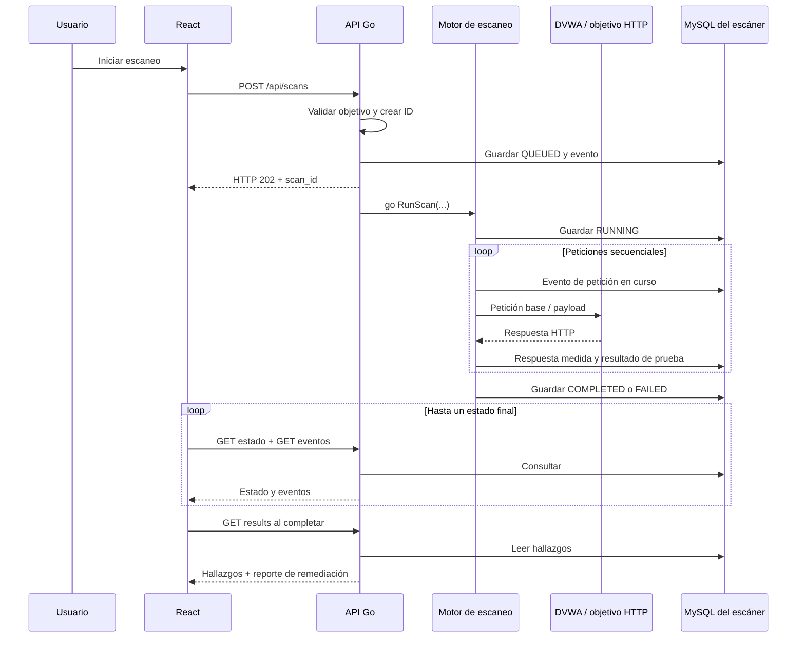

# Guía para entender el código de SQLi Studio

Esta guía describe el código activo después de la limpieza del 4 de octubre de
2026. Se lee con el editor y la aplicación abiertos. Los enlaces apuntan a los
archivos reales; busca los nombres de las funciones para encontrarlos aunque
cambien los números de línea.

## 1. Qué hace el proyecto

SQLi Studio coordina pruebas HTTP de inyección SQL y presenta sus resultados.
Tiene dos recorridos: el módulo SQL Injection de DVWA local y el análisis de
parámetros GET de una URL. El backend guarda estados, eventos y hallazgos en
MySQL. El frontend consulta esa información y la presenta.

La aplicación observa respuestas HTTP. No conoce la consulta SQL que ejecutó
el objetivo, no tiene un sensor eBPF y no modifica automáticamente su código.
El reporte ofrece ejemplos de remediación para que una persona los adapte.



Una petición es un intercambio HTTP. Una prueba puede necesitar varias
peticiones. Un hallazgo es una prueba cuyo resultado fue `DETECTED`. Un evento
es una entrada de la bitácora. Por eso seis peticiones de DVWA producen dos
pruebas, y esas dos pruebas pueden producir dos hallazgos.

## 2. Orden para recorrer TODO el código

| Bloque | Archivos | Lo que debemos poder explicar al terminar |
| --- | --- | --- |
| 1 | `frontend/src/main.jsx`, `App.jsx`, `scans/targets.js` | Cómo aparece React y se selecciona un modo |
| 2 | `frontend/src/hooks/useScan.js` | Cómo se inicia, consulta y termina un escaneo |
| 3 | `frontend/src/scans/events.js`, `components/*` | Cómo los eventos se convierten en logs y evidencia |
| 4 | `backend/main.go`, `router/router.go`, `handlers/handlers.go` | Cómo una solicitud llega al motor |
| 5 | `backend/models/models.go`, `policy/targets.go` | Qué datos intercambiamos y cómo se valida el objetivo |
| 6 | `backend/scanner/engine.go`, `probes.go` | Cómo se coordina la ejecución y se mide HTTP |
| 7 | `backend/scanner/dvwa.go` | Cómo se autentica DVWA y se detecta una diferencia booleana |
| 8 | `backend/scanner/authorized.go`, `discovery.go` | Cómo cambia el recorrido de una URL |
| 9 | `backend/database/*`, esquema SQL, `remediation/report.go` | Qué se persiste y qué se genera al consultar |
| 10 | Compose, Dockerfiles, scripts, configuración y pruebas | Cómo se ejecuta y verifica el sistema completo |

En cada bloque: leer la función de entrada, identificar sus datos, seguir sus
llamadas y provocar un caso real. No hace falta memorizar sintaxis para entender
el recorrido; sí debemos poder explicar qué condición decide el siguiente paso.

## 3. Frontend: montaje y pantalla

### `frontend/index.html` y `src/main.jsx`

[`index.html`](../frontend/index.html) contiene el nodo `root` y carga `main.jsx`.
[`main.jsx`](../frontend/src/main.jsx) crea la raíz de React y monta `<App />`.
`React.StrictMode` ayuda a detectar errores de efectos durante el desarrollo;
por eso los efectos deben liberar sus temporizadores y peticiones al desmontarse.

### `src/App.jsx`

[`App`](../frontend/src/App.jsx) organiza la pantalla. Conserva tres decisiones
del usuario: modo seleccionado, URL escrita y nivel DVWA. Busca el modo en
`TARGET_PRESETS` y se lo entrega a `useScan`.

La pantalla inicial tiene dos accesos. Al escoger uno, aparece el formulario y
las dos columnas de ejecución. Cambiar modo, URL o nivel limpia el resultado
anterior. Mientras hay un escaneo, los controles quedan deshabilitados.

`App` conecta el formulario con `handleStartScan` y distribuye los datos del hook
a los componentes. No autentica DVWA ni decide si una respuesta confirma SQLi.

### `src/scans/targets.js`

[`targets.js`](../frontend/src/scans/targets.js) contiene:

- `TARGET_PRESETS`: los dos modos visibles y sus identificadores para la API.
- `FINAL_STATUSES`: `COMPLETED` y `FAILED`, que detienen la consulta periódica.
- `validateExternalUrl`: normaliza la URL con `new URL`, exige HTTP/HTTPS y
  rechaza fragmentos `#`, que el navegador no envía al servidor. Admite hosts
  locales, IP, puertos y credenciales; la validación del backend se ejecuta otra
  vez independientemente de esta comprobación.

## 4. Frontend: ciclo de vida del escaneo

[`useScan`](../frontend/src/hooks/useScan.js) agrupa el estado y las peticiones.

| Dato | Para qué sirve |
| --- | --- |
| `scanId` | Identificador usado en todas las consultas posteriores |
| `scanStatus` | Estado y metadatos devueltos por la API |
| `events` | Bitácora recibida desde MySQL |
| `report` | Recomendaciones recibidas desde `/results` |
| `isRunning` | Activa la consulta periódica y bloquea los controles |
| `errorMessage` | Explica un fallo al usuario |
| `connectionError` | Aviso de consulta interrumpida, separado del estado del escaneo |
| `pollRevision` | Reinicia la consulta manual sobre el mismo ID |
| `elapsedMS` | Tiempo desde iniciar hasta recibir el resultado en el navegador |
| `startedRef` | Hora monotónica de inicio, conservada sin generar renders |
| `submissionRef` | Bloquea dos envíos antes de que React actualice el estado |

`useState` guarda un valor y pide a React que vuelva a representar la pantalla
cuando cambia. `useRef` conserva un valor mutable entre renders. `useEffect`
ejecuta trabajo externo a la representación y devuelve su función de limpieza.

### `handleStartScan`

1. Evita la recarga del formulario con `event.preventDefault()`.
2. Comprueba modo, ejecución existente y URL.
3. Limpia el resultado anterior, inicia el reloj y activa `isRunning`.
4. Construye el JSON del modo seleccionado.
5. Envía `POST /api/scans` con Axios y un timeout de 15 segundos.
6. Guarda el ID recibido. Tener el ID permite empezar a consultar el avance.
7. Si la creación falla, presenta el error y detiene el reloj.

Ejemplo del JSON para el laboratorio:

```json
{"mode":"dvwa","target":"dvwa","dvwa_level":"medium"}
```

### Efecto del reloj

Actualiza `elapsedMS` cada 100 ms mientras `isRunning` es verdadero. Usa
`performance.now()`, adecuado para medir un intervalo sin depender de cambios
en la hora del sistema. Al detenerse elimina el intervalo.

### Efecto de consulta periódica

Necesita `isRunning` y `scanId`. [`watchScan`](../frontend/src/scans/polling.js)
consulta estado y eventos de forma secuencial.
Si todavía no terminó, programa otra consulta 350 ms después. Usa `setTimeout`
después de recibir las respuestas, para evitar consultas superpuestas.

Al completar, consulta `/results` y guarda el reporte. Al fallar, muestra el
mensaje persistido. `AbortController` cancela las peticiones al cambiar de
escaneo o desmontar el componente; no cancela el trabajo del backend.

Un fallo al consultar conserva el ID, el estado conocido y la evidencia. Muestra
un aviso y reintenta con esperas de 1, 2, 4, 8 y hasta 10 segundos. «Volver a
consultar» reinicia el seguimiento del mismo ID; no envía otro POST. Si falla
`/results`, también vuelve a consultar antes de dar por finalizado el seguimiento.
Solo una respuesta FAILED del backend establece un fallo del escaneo.

Los conteos se derivan de los eventos. Solo las pruebas reales cuentan como
hallazgos. El avance cuenta respuestas de la etapa `probe`, sin sumar el login.
El cronómetro de la interfaz incluye esperas de consulta y no es la métrica del
benchmark.

## 5. Frontend: eventos, logs y evidencia

### `src/scans/events.js`

[`events.js`](../frontend/src/scans/events.js) transforma los eventos de la API:

- `parsePayloadEvents`: interpreta el JSON de `PAYLOAD_EXECUTED` y los antiguos
  `PAYLOAD_DEMONSTRATION`; descarta mensajes malformados. Marca las simulaciones
  históricas para que nunca se cuenten como vulnerabilidades reales.
- `eventMessage`: traduce eventos de ciclo de vida y resume el resultado de las
  pruebas, conservando el mensaje original si no conoce el tipo.
- `buildLogEntries`: utiliza un `Map` de `step_id` a posición de fila. Cuando
  llega la respuesta de una petición, sustituye su fila «en curso». Conserva la
  ubicación inicial y evita duplicar cada solicitud en la consola.

La compatibilidad con demostraciones antiguas sigue siendo necesaria: eliminarlas
sin conservar esta distinción podría presentar datos históricos como reales.

### Componentes

| Archivo / función | Responsabilidad |
| --- | --- |
| [`ScanStatus.jsx`](../frontend/src/components/ScanStatus.jsx): `ModeIcon` | Iconos SVG de laboratorio y URL |
| `ScanError` | Error y acción opcional para abrir el laboratorio |
| `ScanConnectionNotice` | Aviso de conexión interrumpida y consulta manual del mismo escaneo |
| `StatusBanner` | Estado general, diferenciando fallo, hallazgos y resultado no concluyente |
| [`EventStreamConsole.jsx`](../frontend/src/components/EventStreamConsole.jsx): `EventStreamConsole` | Scroll automático y lista de logs |
| `LogRow` | Hora, método, HTTP, duración y detalle de una petición o prueba |
| [`ProbeDetail.jsx`](../frontend/src/components/ProbeDetail.jsx): `ProbeDetail` | Valor original, payload, query codificada, URL final y comparaciones |
| [`FindingCard.jsx`](../frontend/src/components/FindingCard.jsx): `FindingCard` | Resultado de una prueba y evidencia desplegable |
| [`RemediationSection.jsx`](../frontend/src/components/RemediationSection.jsx): `RemediationSection` | Recomendaciones y ejemplos de código |

«Pausar» cambia únicamente `followLogs`; no detiene peticiones. Desplazarse hacia
arriba también desactiva el seguimiento. Los elementos `<details>` muestran el
detalle al solicitarlo, manteniendo la pantalla compacta.

Los valores se representan como texto de React, sin insertar HTML del objetivo.
Se usa `??` o `!= null` al presentar métricas para conservar un cero real. Un
`0` de registros no significa que falte información. `FindingCard` también muestra
pruebas sin detección; el contador de vulnerabilidades solo suma las detectadas.

[`App.css`](../frontend/src/App.css) define colores, tipografía, controles, logs,
evidencia y adaptación a pantallas de 800 y 520 px. También respeta la preferencia
de movimiento reducido. `public/studio.svg` es el favicon.

## 6. Backend: arranque, rutas y controladores

### `main.go`

[`main`](../backend/main.go) conecta con la base de datos, crea el repositorio y
cierra los escaneos interrumpidos antes de construir el router y escuchar en el
puerto 8080. [`FailInterruptedScans`](../backend/database/recovery.go) guarda
FAILED, fecha de cierre y SCAN_FAILED en una transacción con límite de 30 segundos.
Solo afecta QUEUED/RUNNING de la ejecución anterior; conserva eventos y hallazgos.
Está diseñado para la única instancia del backend en Compose. No reanuda peticiones
automáticamente, porque sus credenciales y contextos de ejecución no se persisten.
`defer` registra el cierre de
la conexión para cuando la función termine. Si no consigue conectar, el backend
no comienza a atender solicitudes. Tampoco sirve la API si falla la reconciliación
de los escaneos interrumpidos.

### `router/router.go`

[`SetupRouter`](../backend/router/router.go) crea Gin, añade CORS y registra:

| Método y ruta | Controlador | Resultado |
| --- | --- | --- |
| `GET /health` | `HealthHandler` | Salud HTTP y conexión con MySQL |
| `POST /api/scans` | `StartScanHandler` | `202` y el ID del escaneo |
| `GET /api/scans/:id` | `GetScanStatusHandler` | Estado y fechas |
| `GET /api/scans/:id/events` | `GetScanEventsHandler` | Bitácora completa en orden |
| `GET /api/scans/:id/results` | `GetScanResultsHandler` | Hallazgos y reporte |

El middleware de CORS contesta `OPTIONS` con `204`. Vite y Nginx normalmente
actúan como proxy, por lo que el navegador utiliza rutas `/api` del mismo origen.

### `handlers/handlers.go`

[`Handler`](../backend/handlers/handlers.go) conserva el repositorio recibido en
`NewHandler`: es la dependencia usada para guardar y consultar datos.

- `StartScanHandler`: interpreta JSON, valida el objetivo, crea un ID aleatorio,
  guarda `QUEUED`, registra el evento y lanza `go scanner.RunScan(...)`.
- `generateScanID`: lee 16 bytes aleatorios criptográficos y los representa con
  32 caracteres hexadecimales. No utiliza un contador compartido.
- `GetScanStatusHandler`: consulta el registro; distingue un ID inexistente de
  un fallo de base de datos. No vuelve a generar el reporte en cada consulta.
- `GetScanResultsHandler`: lee hallazgos y llama a `GenerateReport` al consultar.
- `GetScanEventsHandler`: devuelve eventos y su cantidad. La consulta actual de
  eventos no hace la misma comprobación de existencia que la consulta de estado.
- `HealthHandler`: usa el contexto de la petición para comprobar MySQL.

La palabra `go` crea una goroutine. El handler puede responder sin esperar el
escaneo. Dentro de cada escaneo las sondas son secuenciales; no hay un worker
pool ni un límite global de escaneos simultáneos. `QUEUED` es un estado inicial
persistido, no una cola de trabajos duradera.

## 7. Modelos y validación del objetivo

[`models.go`](../backend/models/models.go) contiene las estructuras de datos.
Las etiquetas `json:"..."` fijan el nombre del campo en HTTP. `omitempty` omite
valores vacíos. Los punteros a métricas permiten distinguir «no medido» de cero.

| Estructura | Uso |
| --- | --- |
| `ScanRequest` | JSON de creación |
| `ScanStatusResponse` | Registro del escaneo y respuesta de estado |
| `Finding` | Hallazgo persistido |
| `ScanEventResponse` | Evento leído desde MySQL; `Message` puede contener JSON |
| `PayloadExecutionEvent` | Resultado de una prueba, con evidencia y cobertura |
| `LabActivityEvent` | Inicio/respuesta de una petición; también se usa para URL |
| `ProbeCheck` | Etiqueta y valor de una comparación medida |
| `CodeComparison` | Ejemplo vulnerable y parametrizado |
| `RemediationReport` | Resumen y recomendaciones |

[`policy/targets.go`](../backend/policy/targets.go) recibe `TargetRequest` y
devuelve `AuthorizedTarget`. El objeto validado es el que recibe el motor.

- `ValidateTarget`: selecciona DVWA o URL. `sandbox` permanece como alias de
  compatibilidad que conduce al mismo DVWA, no a los servicios eliminados.
- `validateSandboxTarget`: solo admite el identificador local `dvwa`.
- La validación del laboratorio acepta Low/Medium y ajusta nombre y URL. Si no
  recibe nivel, utiliza Low; la interfaz selecciona Medium explícitamente.
- `validateExternalTarget`: requiere el indicador de autorización, longitud
  máxima de 2048, HTTP/HTTPS, host y ausencia de fragmentos. Separa credenciales
  Basic de la URL antes de devolverla.
- `detectOptionalParameter`: escoge el primer parámetro analizable en orden
  alfabético, para los metadatos iniciales. El motor después obtiene todos los
  candidatos válidos hasta su límite.
- `normalizeHost`: normaliza minúsculas y punto final del host.

El indicador `authorization_confirmed` es un booleano del cliente; no verifica
propiedad del dominio. La interfaz actualmente lo envía automáticamente. No hay
lista de dominios ni bloqueo de direcciones privadas. Las credenciales Basic
permanecen en memoria y `json:"-"` evita serializarlas.

## 8. Motor y transporte HTTP compartido

### `scanner/engine.go`

[`RunScan`](../backend/scanner/engine.go) marca `RUNNING`, registra inicio y elige
`runDVWAScan` o `runAuthorizedURLDiscovery`. Un error del motor produce `FAILED`
con su causa. Si termina el recorrido, guarda `COMPLETED` y el evento final.

Completar el recorrido no equivale a detectar una vulnerabilidad: puede terminar
con pruebas negativas o con un evento `SCAN_INCONCLUSIVE`. Si falla una escritura
de estado, se registra en el log del servidor. El siguiente arranque cierra
QUEUED/RUNNING como interrumpidos; no vuelve a ejecutar sus solicitudes.

`runAuthorizedURLDiscovery` toma directamente los parámetros de la URL. Solo
inicia descubrimiento cuando no encuentra candidatos. Selecciona hasta ocho,
calcula el total esperado de peticiones y ejecuta cada candidato secuencialmente.

### `scanner/probes.go`

[`probes.go`](../backend/scanner/probes.go) contiene:

- `requestResult`: estado HTTP, duración, cuerpo temporal y URL final.
- `performRequest`: GET con contexto de diez segundos, User-Agent y lectura
  máxima de 1 MiB. Mide hasta terminar de leer el cuerpo. Rechaza respuestas
  grandes en lugar de comparar HTML truncado.
- `replaceQueryValue`: sustituye el parámetro existente con `url.Values`, que
  también realiza la codificación URL. Conserva los otros parámetros.
- `emitPayloadEvent`: convierte el resultado a JSON y lo guarda como evento.

`defer resp.Body.Close()` libera el cuerpo de la respuesta. Los cuerpos HTML
se usan para comparar en memoria; no se guardan completos en la bitácora.

## 9. Laboratorio DVWA, función por función

[`dvwa.go`](../backend/scanner/dvwa.go) tiene su propio cliente con cookies y
autenticación. Cada escaneo crea una sesión independiente.

| Función | Qué hace |
| --- | --- |
| `csrfToken` | Recorre el HTML y obtiene el input `user_token` |
| `dvwaRows` | Extrae bloques de resultados con First name/Surname, ignorando el ID reflejado |
| `newDVWAClient` | Crea cookie jar y restringe redirecciones al origen DVWA |
| `dvwaPost` | Envía formularios codificados y aplica timeout/límite de respuesta |
| `observeDVWA` | Notifica a un observador si existe |
| `dvwaRequest` | Registra inicio y respuesta con el mismo step_id; mide bytes y registros |
| `loginDVWA` | Login con CSRF, cookies y confirmación del nivel seleccionado |
| `probeDVWA` | Ejecuta las seis solicitudes y devuelve dos resultados de prueba |
| `runDVWAScan` | Coordina credenciales, sesión, observación y persistencia |

`loginDVWA` lee `/login.php`, envía el formulario, verifica que llegó una página
autenticada, lee `/security.php`, envía otro token y comprueba el nivel en la
respuesta. No registra el cuerpo de los formularios de autenticación.

`probeDVWA` decide GET para Low y POST para Medium. Envía:

1. Base `id=1`, que debe devolver al menos un registro.
2. Comilla `1'`, buscando una firma SQL nueva frente a la base.
3. Condición verdadera y condición falsa.
4. Las dos condiciones nuevamente, para comprobar reproducibilidad.

En Low las condiciones se adaptan al contexto entre comillas. En Medium son
expresiones numéricas. La prueba booleana exige resultados estables entre las
repeticiones, condición verdadera igual a los registros base y condición falsa
sin registros. La comparación se realiza sobre registros extraídos, porque el
HTML de DVWA refleja el payload y contiene elementos ajenos a los resultados.

Si falla una petición, se conserva la prueba ya terminada. Un login inválido,
setup pendiente, nivel no confirmado o respuesta inesperada detiene el análisis.
Los nombres devueltos se usan en memoria para comparar; en logs solo aparecen
las cantidades.

## 10. Análisis por URL

### `scanner/authorized.go`: cliente y observación

[`authorized.go`](../backend/scanner/authorized.go) reúne el transporte, las
comparaciones y la persistencia común de pruebas HTTP.

- `externalRequestError`: presenta errores DNS, timeout y otros fallos.
- `repositoryHTTPObserver`: transforma actividad en eventos `HTTP_ACTIVITY`.
- `observeHTTP`: ejecuta el observador cuando no es nil.
- `authorizedClient`: valida el origen, limita redirecciones e instala transporte.
- `authorizedTransport.RoundTrip`: exige mismo protocolo/host/puerto y añade
  Basic Auth a las cabeceras. Las credenciales no forman parte de la URL guardada.
- `pacedTransport.RoundTrip`: espera 300 ms por petición y respeta cancelación.
- `sqlErrorSignature`: busca seis patrones conocidos de errores SQL.

### `scanner/authorized.go`: pruebas y resultados

- `authorizedProbeCount`: tres peticiones para texto o siete para un valor que
  solo contiene dígitos.
- `isNumericValue`: comprueba esos dígitos; no incluye números negativos o decimales.
- `yesNo`: presenta una comparación booleana como Sí/No.
- `responseChecks`: compara contenido completo, diferencia de bytes y firma SQL.
- `probeAuthorizedCandidateWithTrace`: registra cada petición y realiza pruebas.
- `probeAuthorizedCandidate`: adaptador usado en pruebas para ejecutar un candidato
  sin observador; no es un motor alternativo.
- `executeAuthorizedProbes`: crea cliente, ejecuta y guarda los resultados completos
  aunque después haya ocurrido un fallo.
- `saveHTTPProbeEvents`: guarda todos los resultados y solo crea un `Finding`
  cuando el resultado es `DETECTED`. Lo comparten DVWA y el recorrido por URL.

El candidato tiene dos respuestas base y una comilla. Una base distinta de
HTTP 200 detiene las sondas. La detección de error SQL requiere una firma ausente
en ambas bases. HTTP 403/429 o ciertos errores sin firma generan un resultado
no concluyente.

Para un parámetro numérico, se añaden dos pares verdadero/falso. Se comprueban
HTTP 200, base estable, reproducción de las respuestas y condición verdadera
igual a la base. La falsa debe cambiar la base y no limitarse a reflejar el
payload. Para texto se omite esta comparación y se explica la cobertura.

Ejemplo: `flag=failed` pasa a `flag=failed%27`. `failed` era el valor de entrada;
no es un error de ejecución de la aplicación. HTTP 200 significa que recibimos
respuesta, no que sepamos qué consulta ejecutó el servidor. Dos cuerpos del
mismo tamaño pueden tener distinto contenido.

### `scanner/discovery.go`

[`discovery.go`](../backend/scanner/discovery.go) busca enlaces cuando la entrada
no tiene parámetros analizables. Usa una cola de páginas y conjuntos de URLs
visitadas, páginas en cola y candidatos conocidos.

| Función / estructura | Papel |
| --- | --- |
| `DiscoveryCandidate` | URL, parámetro y valor original |
| `DiscoverySummary` | URL inicial y contadores del recorrido |
| `discoveryQueueItem` | URL y profundidad para la cola |
| `discoveryPageResult` | HTML, estado y URL tras redirecciones |
| `discoverCandidates` | Recorre hasta cinco páginas a profundidad uno y ordena candidatos |
| `fetchDiscoveryPage` | GET de ocho segundos; exige HTML, HTTP 200 y límite de 1 MiB |
| `extractPageLinks` | Tokeniza el HTML y obtiene enlaces `<a href>` |
| `resolveDiscoveredLink` | Resuelve rutas relativas y exige el mismo origen |
| `extractCandidates` | Obtiene valores GET válidos, con límites de nombre y longitud |
| `appendUniqueCandidates` | Deduplica URL + nombre del parámetro |
| `normalizeDiscoveredURL` | Elimina fragmento, normaliza host y ruta vacía |
| `removeQueryValues` | Produce la dirección de una página sin query para recorrerla |
| `shouldIgnorePath` | Descarta recursos estáticos y rutas con acciones como logout/delete |

Si falla la página inicial, devuelve error. Si falla una página secundaria,
continúa con las demás siempre que pueda guardar la evidencia de ese fallo.
Un error al guardar HTTP_ACTIVITY detiene tanto el descubrimiento como las sondas;
se propaga al motor y conserva los hallazgos anteriores. No procesa formularios, JavaScript, login personalizado
o parámetros POST en este modo. Los filtros de rutas son heurísticos; no
describen todo el comportamiento de un sitio.

## 11. Persistencia y reporte

### Conexión y repositorio

[`database.go`](../backend/database/database.go): `getEnvironment` lee valores
con fallback; `Connect` crea el pool MySQL y reintenta hasta diez veces;
`Ping` comprueba disponibilidad; `Close` cierra el pool. Los límites de conexiones
son del pool de base de datos, no del número de escaneos.

[`repository.go`](../backend/database/repository.go):

| Método | Operación |
| --- | --- |
| `NewRepository` | Recibe el pool SQL compartido |
| `CreateScan` | Inserta el registro inicial |
| `GetScan` | Lee estado y representa fechas como RFC3339 |
| `UpdateScanStatus` | Actualiza estado, causa de error y fechas de inicio/final |
| `CreateFinding` | Guarda hallazgo con evidencia HTTP |
| `GetFindingsByScanID` | Lee hallazgos en orden, sin inventar validación dual |
| `CreateScanEvent` | Inserta un evento y devuelve el error si falla |
| `CreateEventWithoutInterrupting` | Registra el fallo en el servidor, sin detener una sonda |
| `FailInterruptedScans` en `recovery.go` | Cierra los escaneos interrumpidos y su evento en una transacción |
| `GetScanEventsByScanID` | Lee todos los eventos en orden de ID |

Las sentencias usan `?` y argumentos separados. Esto protege las consultas de
la base del escáner. La entrada usada como payload se dirige al objetivo HTTP;
no se concatena dentro de estas consultas administrativas.

El [esquema SQL](../infrastructure/mysql/scanner/init/001_schema.sql) tiene tres
tablas: `scans`, `findings` y `scan_events`. Las dos últimas apuntan al ID de
`scans` mediante claves foráneas. El payload detallado se conserva en eventos;
la tabla `findings` no tiene una columna de payload. Sus columnas de tiempos
existen, pero el guardado HTTP actual no las rellena con las duraciones de la
sonda: para tiempos medidos hay que consultar los eventos.

La base de DVWA es distinta: almacena los usuarios y datos vulnerables del
laboratorio. El backend no utiliza esa conexión para detectar; se comunica con
DVWA a través de HTTP.

### `remediation/report.go`

[`GenerateReport`](../backend/remediation/report.go) se ejecuta al consultar
resultados. Si no hay hallazgos, devuelve riesgo `UNDETERMINED` y pide revisar
la cobertura. Si existen, entrega recomendaciones sobre consultas preparadas,
validación y permisos, con ejemplos Go/PHP/Python.

Para DVWA reduce los ejemplos al de PHP y adapta GET/POST a Low/Medium usando
el nombre del objetivo guardado. Los ejemplos son didácticos: deben adaptarse
a la conexión, esquema y manejo de errores de la aplicación que se corrija.
El reporte no está persistido ni aplica un parche. Su `generated_at` es la hora
de generación al consultar, no la de finalización del escaneo.

## 12. Infraestructura, dependencias y scripts

| Archivo | Qué debemos entender |
| --- | --- |
| [`compose.yaml`](../compose.yaml) | Servicios, dependencias de salud, redes, puertos locales y volúmenes |
| [`docker-compose.yml`](../docker-compose.yml) | Incluye Compose principal por compatibilidad; no duplica servicios |
| [`.env.example`](../.env.example) | Variables que realmente usan Compose y el backend |
| [`backend/Dockerfile`](../backend/Dockerfile) | Descarga módulos, ejecuta pruebas, compila y sirve con usuario sin privilegios |
| [`frontend/Dockerfile`](../frontend/Dockerfile) | `npm ci`, compilación Vite y Nginx para producción |
| `.dockerignore` de frontend/backend | Excluye builds, dependencias locales, logs y entornos del contexto Docker |
| [`frontend/vite.config.js`](../frontend/vite.config.js) | Servidor de desarrollo en 3000 y proxy al backend |
| [`frontend/nginx.conf`](../frontend/nginx.conf) | Proxy `/api`, salud y fallback de rutas a index.html |
| [`frontend/eslint.config.js`](../frontend/eslint.config.js) | Comprobación estática y reglas de hooks |
| `frontend/package.json` / `package-lock.json` | Dependencias directas / árbol exacto reproducible |
| `backend/go.mod` / `go.sum` | Módulos directos, indirectos y hashes de integridad |
| [`.gitignore`](../.gitignore) | Artefactos locales que no se versionan |
| [`infrastructure/dvwa/initialize.php`](../infrastructure/dvwa/initialize.php) | Inicializa DVWA mediante setup oficial solo si no existe la tabla users |

Las redes internas separan las bases. El backend tiene salida para HTTP por
`public_net` y acceso a DVWA/MySQL por `scanner_net`. Los servicios públicos se
exponen en loopback. Los volúmenes conservan datos al recrear contenedores.

`initialize.php` comprueba la tabla de usuarios, obtiene cookie/CSRF y envía setup.
Su función `requestSetup` mantiene la cookie entre solicitudes. No reinicia una
base existente. El servicio `dvwa-init` debe terminar correctamente antes de que
arranque el backend.

Los scripts de shell se ejecutan desde la raíz:

- [`start.sh`](../scripts/start.sh): valida configuración y levanta servicios.
- [`status.sh`](../scripts/status.sh): muestra su estado.
- [`stop.sh`](../scripts/stop.sh): baja contenedores, conservando volúmenes.
- [`reset.sh`](../scripts/reset.sh): exige escribir RESET y elimina también los
  volúmenes. No se utilizó durante la limpieza.

[`benchmark_dvwa.py`](../scripts/benchmark_dvwa.py) es una herramienta independiente:

- `request` realiza solicitudes con urllib; `token` obtiene el CSRF.
- `login` abre una sesión Low para sqlmap.
- `app_run` inicia la app y consulta hasta finalizar, midiendo con reloj monotónico.
- `sqlmap_run` utiliza sesión y salida temporal nuevas, solo técnica booleana,
  y comprueba evidencia final de detección.
- `main` alterna el orden de herramientas, calcula medianas y escribe Markdown/JSON.

No se ejecuta desde React ni automáticamente con un escaneo. La comparación
local tiene distinta cobertura, número de peticiones y rutas de red; no representa
una clasificación general de herramientas. `tools/sqlmap` es una copia externa.

## 13. Pruebas: qué demuestran

| Archivo | Cobertura principal |
| --- | --- |
| [`frontend/tests/evidence.test.mjs`](../frontend/tests/evidence.test.mjs) | Render de componentes y funciones reales: logs, ceros, evidencia, simulaciones históricas, URLs y errores |
| [`backend/policy/targets_test.go`](../backend/policy/targets_test.go) | Niveles, objetivo DVWA, URL válida y credenciales fuera de persistencia |
| [`backend/scanner/dvwa_test.go`](../backend/scanner/dvwa_test.go) | Cookies/CSRF, POST Medium, conteos, repeticiones y fallos parciales |
| [`backend/scanner/authorized_test.go`](../backend/scanner/authorized_test.go) | Sondas con servidores HTTP de prueba, timeout, límites, estabilidad, Basic Auth y origen |
| [`backend/remediation/report_test.go`](../backend/remediation/report_test.go) | Recomendaciones sin afirmaciones falsas de kernel/protección; ejemplo Medium POST |
| [`tests/integration/dvwa.ps1`](../tests/integration/dvwa.ps1) | API a través del proxy del frontend, DVWA real, dos pruebas y seis respuestas |
| [`tests/integration/authorized-url.ps1`](../tests/integration/authorized-url.ps1) | Persistencia y actividad real de una URL directa; usa salud local por defecto |
| [`tests/integration/infrastructure.sh`](../tests/integration/infrastructure.sh) | Contenedores, tablas, datos iniciales y salud |

Los tests Go del scanner utilizan `httptest` para controlar exactamente las
respuestas. La prueba externa `TestLiveAuthorizedTarget` es opt-in y no se
ejecutó durante esta limpieza. Los tests frontend importan módulos reales con
esbuild y renderizan con React; no extraen texto de App.jsx para fingir módulos.
No sustituyen una prueba del ciclo completo en navegador.

```powershell
# Desde frontend
npm test
npm run lint
npm run build

# Desde backend
go test ./...

# Desde la raíz, con servicios activos
./tests/integration/dvwa.ps1 -Level medium
./tests/integration/dvwa.ps1 -Level low
./tests/integration/authorized-url.ps1 -ExpectedStatus COMPLETED
```

La construcción Docker del backend también ejecuta `go test ./...`. En este
equipo Windows bloqueó algunos ejecutables temporales de Go; la suite completa
se verificó en Linux dentro de Docker.

## 14. Material histórico y límites que siguen vigentes

`docs/workshop` describe el laboratorio anterior y se conserva como material
histórico. `docs/workshop-90/entregables` contiene la exposición actual y su guía.
Las capturas y mediciones en `docs` son evidencia de ejecuciones concretas, no
datos que el motor reutilice para detectar vulnerabilidades.

`legacy/` contiene copias locales ignoradas por Git, sin imports ni servicios
activos. La carpeta privada `.build` del workshop contiene herramientas y
renders de construcción de las diapositivas, no código de la aplicación.

La limpieza retiró piezas sin uso del código activo. Permanecen límites reales:
sin cancelación del escaneo en backend, sin reanudación de solicitudes tras un
reinicio, sin paginación de eventos ni límite global de escaneos simultáneos,
y análisis por URL limitado a GET. Los modelos de eBPF y el worker pool antiguo
no deben interpretarse como funcionalidades pendientes de activar con una variable.

## 15. Primera sesión de estudio: seguir un clic

1. Abrir `App.jsx`: localizar `onSubmit={handleStartScan}`. La pantalla entrega
   el evento al hook; no contiene las sondas SQL.
2. Abrir `useScan.js`: seguir `handleStartScan` hasta el POST y observar el JSON.
3. Abrir `router.go`: encontrar la ruta que recibe ese POST.
4. Abrir `handlers.go`: seguir validación → CreateScan → `go RunScan` → HTTP 202.
5. Abrir `engine.go`: identificar dónde cambia a RUNNING y elige DVWA.
6. Iniciar Medium en la app y observar una petición en curso que se convierte
   en respuesta. Seguir `step_id` hasta `buildLogEntries`.

Debemos poder responder: ¿por qué el POST puede contestar antes de terminar?,
¿quién realiza las peticiones al objetivo?, ¿de dónde salen los logs?, ¿por qué
hay seis respuestas y dos pruebas?, y ¿qué significa realmente COMPLETED?

La siguiente sesión recorre `loginDVWA` y `probeDVWA` paso a paso, usando una
solicitud base, una comilla y dos condiciones booleanas. Después seguimos URL,
persistencia y remediación hasta completar el mapa anterior.
