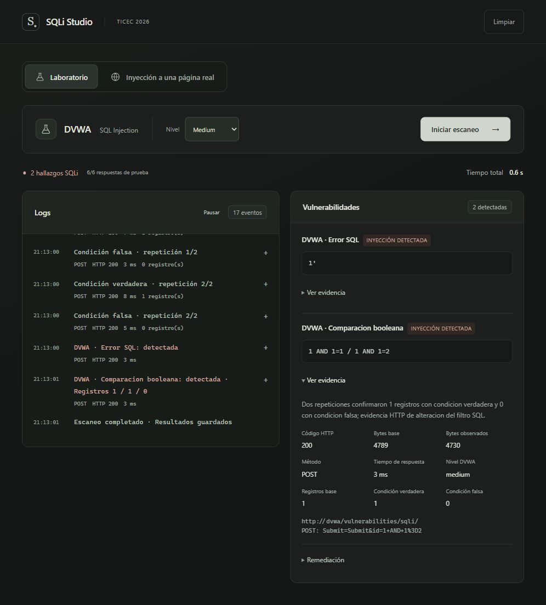

# Limpieza del código activo — 4 de octubre de 2026

## Código retirado y motivo

| Pieza | Motivo |
| --- | --- |
| `backend/api/handlers.go` | Wrappers que no utilizaba el router; las rutas ya usan `handlers` |
| `max_workers` y argumento de `RunScan` | Las sondas actuales son secuenciales; el valor no controlaba la ejecución |
| `ScanTask` y cabeceras de correlación antiguas | Solo se construía una tarea vacía; ningún sensor las consumía |
| Modelos HTTP/kernel de confirmación dual | El motor activo produce evidencia HTTP; no genera estos objetos |
| Deserialización antigua de confirmación dual | Podía convertir evidencia histórica en una afirmación de validación que no utiliza la interfaz |
| Política de kernel y ramas del reporte del antiguo laboratorio | No existe sensor integrado ni aplicación segura activa; no deben declarar protección |
| Reporte generado y descartado en `RunScan` | Se calculaba sin utilizarse |
| Reporte en la consulta periódica de estado | La interfaz lo solicita en `/results`; se eliminó la generación duplicada y una consulta cuyo error se ignoraba |
| `GetDefaultRepository` | Tras retirar wrappers solo lo utilizaba main; ahora main crea explícitamente el repositorio |
| `DiscoverCandidates` público y `SourceURL` del candidato | No tenían consumidores en aplicación ni pruebas |
| Campos `HypotheticalResult` y `RecordsExposed` del emisor | Ningún recorrido activo emitía estas propiedades |
| `frontend/src/Payloads.css` | No se importaba y pertenecía a componentes anteriores |
| `frontend/public/vite.svg` | Favicon sustituido por studio.svg |
| `frontend/public/slides.html` | Copia idéntica del material histórico que permanece en docs/workshop/slides.html |
| Dependencias `@plasmicapp/cli` y `@plasmicapp/react-web` | Sin imports ni comandos activos; se retiraron 101 paquetes del árbol instalado |
| WAF_PORT, BACKEND_PORT_INTERNAL, ALLOWED_TARGETS de .env.example | Ningún servicio o código actual las lee |

Se conservan bases de datos, volúmenes, capturas, benchmarks y presentaciones.
Los backups locales `legacy/` no se importan ni se incluyen en los servicios.

## Organización nueva

`App.jsx` organiza la pantalla y las opciones del usuario. `hooks/useScan.js`
gestiona creación, polling, tiempo y estado. `scans/events.js` interpreta la
bitácora. `components/` contiene las piezas visuales. `scans/targets.js` contiene
los modos y la validación de URL de la interfaz.

Se formatearon los módulos frontend para facilitar su lectura. Los tests importan
los módulos reales, en lugar de extraer funciones mediante cortes de texto de
App.jsx. `npm test` ofrece una entrada única. Se declaró esbuild como dependencia
directa de las pruebas, que ya lo utilizaban indirectamente mediante Vite.
Prettier se utilizó como herramienta temporal, sin añadirlo al proyecto.

`go mod tidy` distingue los tres módulos Go directos de sus dependencias
indirectas. Los `.dockerignore` excluyen dependencias instaladas, builds, logs
y archivos de entorno del contexto de construcción.

## Contratos y compatibilidad

- `GET /api/scans/:id` devuelve estado y fechas. El reporte está en
  `GET /api/scans/:id/results`; la app y el benchmark ya consultan ese endpoint.
- El request ya no declara `max_workers`. Enviar ese campo antiguo no modifica
  la ejecución; Gin ignora campos JSON adicionales por defecto.
- `dual_confirmation` y `kernel_defense_policy` no forman parte de las respuestas
  actuales. La evidencia histórica permanece en su campo original de la base.
- Se conserva `sandbox` como alias de DVWA para solicitudes anteriores.
- El frontend conserva la identificación de eventos de demostración históricos
  para impedir que se presenten o contabilicen como detecciones reales.
- La guía de exposición ahora apunta a los módulos separados. Las diapositivas
  existentes conservan sus fragmentos; para localizar las funciones se utiliza
  la guía actualizada, sin depender de sus referencias antiguas a líneas de App.

## Verificación realizada

- Frontend: 12 pruebas, lint y build correctos después de separar y formatear.
- Backend: suite completa `go test ./...` y compilación correctas dentro de la
  imagen Docker. Windows había bloqueado ejecutables temporales de algunas pruebas.
- Se recreó únicamente backend con la imagen final y quedó saludable.
- Integración DVWA Medium: 2 hallazgos, 2 pruebas reales, 6 respuestas POST.
  Escaneo `1ef97272eec737d2a2c61a3b43b367cd`.
- Integración DVWA Low: 2 hallazgos, 2 pruebas reales, 6 respuestas GET.
  Escaneo `b806998d690dc570b51202175aa5616e`.
- Integración URL: endpoint de salud local, COMPLETED y 7 respuestas medidas.
  Escaneo `9f1d8ca6a1774f5a9431917e2972a61a`. Este endpoint comprueba el flujo,
  no una vulnerabilidad SQL.
- Navegador: Medium completó desde el botón y mostró 2 hallazgos, 6/6 respuestas
  y evidencia de registros 1/1/0. Los detalles se abrieron correctamente.

El mapa de archivos, funciones y recorrido de aprendizaje está en
[CODIGO_GUIA.md](CODIGO_GUIA.md). Las limitaciones que permanecen se describen
allí; esta limpieza no añade cancelación, cola persistente ni sensores de kernel.
